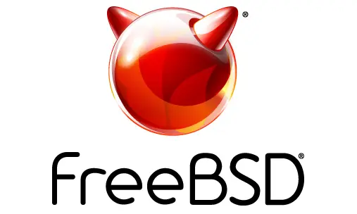

#  Project Title: Keylogger Rootkit for FreeBSD - SYS_READ System Call Hooking

  

## Introduction
The Keylogger Rootkit for FreeBSD is a proof-of-concept project that explores the technique of hooking system calls to create a stealthy keylogging rootkit. This rootkit has been developed in the C programming language and targets FreeBSD operating systems.

## What is a Rootkit?
A rootkit is a type of malicious software designed to gain unauthorized access to a computer system. Once installed, a rootkit can conceal its presence, enabling attackers to execute malicious actions without being detected by traditional security measures.

## Project Objective
The primary objective of this project is to demonstrate how a keylogger rootkit can be developed for FreeBSD by intercepting and modifying the SYS_READ system call. By hooking into this essential system call, the rootkit can capture user keyboard input without their knowledge, potentially compromising sensitive information.

## System Call Hooking
System call hooking involves redirecting the flow of a system call to a custom handler. In this project, we intercept the SYS_READ system call, which is responsible for reading data from file descriptors, and use it to capture keyboard input.

## Features
- Hooking the SYS_READ system call to intercept user input
- Stealthy keylogging without raising suspicion
- Log and store captured keystrokes in a hidden manner
- Explore rootkit implementation techniques for FreeBSD

## Disclaimer
This project is intended for educational and research purposes only.
The developer(s) of this rootkit and the associated code provided in this repository shall not be held responsible for any misuse or unauthorized access to computer systems. Unauthorized use of this code for malicious purposes is strictly prohibited and may violate applicable laws.

## Installation and Usage
Please refer to the 'setup.md' file for detailed instructions on installing and using the keylogger rootkit on FreeBSD.

## Contribution
Contributions to this project are welcome. If you have any suggestions, bug fixes, or improvements, feel free to open an issue or submit a pull request.

## Legal Notice
Using this rootkit on systems you do not own or have explicit permission to access is illegal and unethical. The developer(s) of this project disclaim any responsibility for the misuse of this code.

## Conclusion
The Keylogger Rootkit for FreeBSD demonstrates the powerful capabilities of system call hooking and serves as an educational resource for understanding rootkit development. Use this knowledge responsibly and always adhere to ethical practices in cybersecurity.